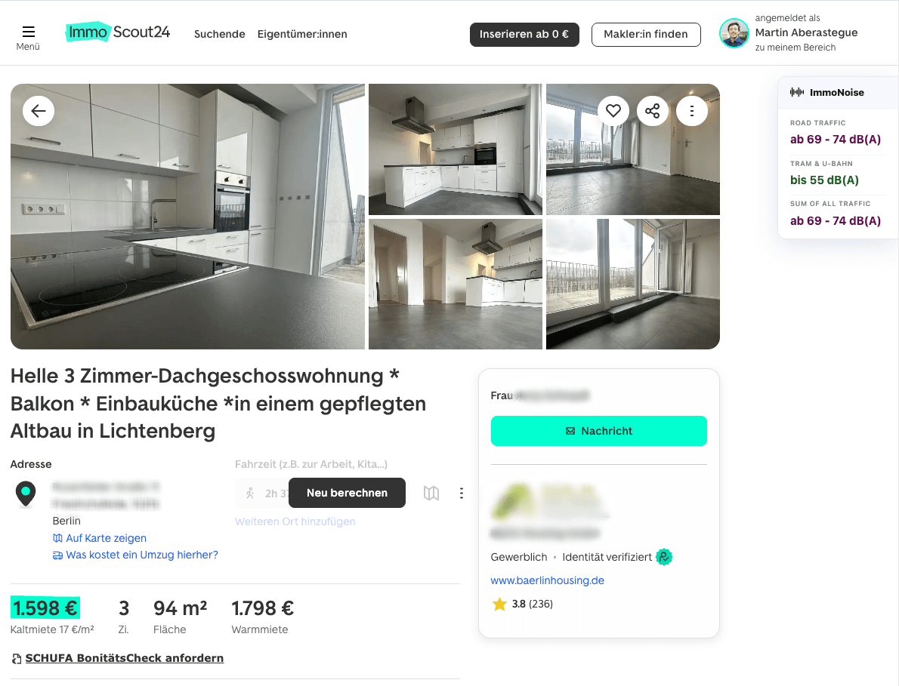

# ImmoNoise Chrome Extension

ImmoNoise is a premium Google Chrome extension that displays road, rail, and overall noise pollution levels directly on **ImmobilienScout24** property expose pages. Specifically designed for **Berlin**, it provides users with crucial environmental data before they even visit a property.

### Key Features

- **Multi-Source Noise Data**: Displays Road Traffic, Tram/U-Bahn, and Sum of All Traffic Sources.
- **Smart City Detection**: Automatically detects the city via JSON-LD schema (currently optimized for Berlin).
- **Proactive UI**: Shows "Coming soon" for properties outside Berlin to manage expectations.
- **Accurate Color Coding**:
  - 🌲 **Dark Green**: bis 55 dB(A) (Quiet)
  - 🟢 **Green**: 55 - 59 dB(A)
  - 🟡 **Yellow**: 59 - 64 dB(A)
  - 🔴 **Red**: 64 - 69 dB(A)
  - 🟣 **Purple**: 69 - 74 dB(A) (Loud)
- **High Performance**: Parallelized API fetching and idle-loading to ensure zero impact on page speed.
- **Premium Design**: Modern glassmorphism UI with smooth animations and an animated wave logo.

## Installation (Developer Mode)

1. **Download/Clone** this repository to your local machine.
2. Open Google Chrome and navigate to `chrome://extensions/`.
3. Enable **Developer mode** (toggle in the top right corner).
4. Click **Load unpacked**.
5. Select the `ImmoNoise` folder where the `manifest.json` is located.
6. Visit any [ImmobilienScout24 Expose](https://www.immobilienscout24.de/expose/...) page in Berlin.

## Technical Details

- **Manifest V3**: Compliant with the latest Chrome extension standards.
- **APIs Used**:
  - [Berlin GDI Geosearch](https://gdi.berlin.de/searches/bkg/geosearch)
  - [Berlin GDI WMS (Umweltatlas 2022)](https://gdi.berlin.de/services/wms/ua_stratlaerm_2022)
- **City Detection**: Parses `application/ld+json` schema for reliable `addressLocality` identification.

## License

MIT License - feel free to use and modify for your own projects!
